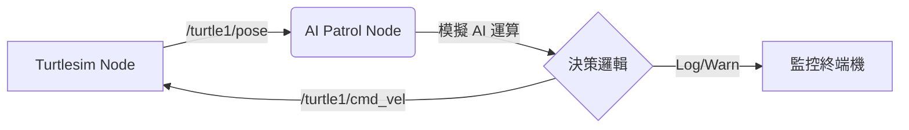

# ROS 2 AI 智慧巡邏機器人模擬 (Turtlesim 版)

## 1. 專案概述 (Overview)

本專案是一個基於 **ROS 2 Humble** 的教學與實作範例，旨在展示如何將「AI 感知邏輯」結合到「機器人控制系統」中。

雖然使用 **Turtlesim** 作為輕量級模擬器，但核心程式碼架構 (`turtlesim_patrol.py`) 採用了與真實機器人完全相同的開發邏輯：**「感知 (Perception) -> 決策 (Decision) -> 控制 (Action)」** 的閉迴路系統。

### 核心功能

* **自主巡邏 (Autonomous Patrol)**: 機器人在限定範圍內直線移動，遇牆自動轉向。
* **模擬 AI 感知 (Mock AI Perception)**: 程式內部模擬電腦視覺模型（如 YOLO），隨機觸發「偵測到入侵者」事件。
* **追蹤與警報 (Tracking & Alert)**: 當發現目標時，機器人會中斷巡邏，自動轉向鎖定目標並發出警報。
* **容器化環境 (Dockerized)**: 透過 Docker 封裝 ROS 2 環境，解決相依性問題並支援 GUI 顯示。

---

## 2. 程式架構 (System Architecture)

### 2.1 檔案結構

```text
ros2_patrol_project/
├── docker-compose.yaml      # 容器啟動設定 (包含 GUI 顯示掛載、Volume 對映)
├── Dockerfile               # 環境建置檔 (基於 osrf/ros:humble-desktop)
├── requirements.txt         # Python 依賴清單 (NumPy, OpenCV, YOLO 等)
├── turtlesim_patrol.py      # [核心] 巡邏機器人控制節點
└── README.md                # 專案說明文件
```

### 2.2 邏輯控制流程 (State Machine)

本系統採用有限狀態機 (Finite State Machine) 進行行為管理：

1. **PATROL (巡邏模式)**
   * **行為**: 以固定速度前進 (`linear.x > 0`)。
   * **條件**: 若邊界檢查觸發 -> 轉彎；若 AI 偵測到目標 -> 切換至 TRACKING。

2. **TRACKING (鎖定模式)**
   * **行為**: 停止前進 (`linear.x = 0`)，原地旋轉 (`angular.z`) 直到面向目標角度。
   * **條件**: 鎖定計時結束 (例如 5秒後) -> 切換回 PATROL。

### 2.3 資料流 (Data Flow)



* **Input**: `/turtle1/pose` (獲取自身位置)
* **Process**: `mock_ai_perception()` (模擬視覺辨識)
* **Output**: `/turtle1/cmd_vel` (速度控制指令)

---

## 3. 環境需求 (Prerequisites)

* **作業系統**: Linux (Ubuntu 建議) 或 Windows (WSL2)。
* **軟體**:
  * Docker Engine
  * Docker Compose
  * X11 Server (Linux 內建; Windows WSL2 需確認 GUI 支援或安裝 VcXsrv)。

---

## 4. 執行步驟 (Execution Steps)

### 步驟 1：建立專案與下載檔案

建立一個資料夾，將 `Dockerfile`, `docker-compose.yaml`, `requirements.txt`, `turtlesim_patrol.py` 放入其中。

### 步驟 2：開放 GUI 顯示權限

為了讓 Docker 內的視窗能顯示在您的螢幕上，請在本機終端機執行：

```bash
xhost +local:root
```

*(若顯示 "access control disabled" 即代表成功)*

### 步驟 3：啟動環境

使用 Docker Compose 建置並啟動容器：

```bash
# 建置並在背景啟動
docker compose up -d --build
```

### 步驟 4：啟動模擬器 (Terminal 1)

開啟一個新的終端機，進入容器並執行 Turtlesim：

```bash
# 進入容器
docker exec -it patrol_bot_container bash

# 啟動模擬器 (請保持此視窗開啟)
ros2 run turtlesim turtlesim_node
```

*此時您應該會看到藍色的海龜視窗。*

### 步驟 5：啟動巡邏程式 (Terminal 2)

開啟**另一個**新的終端機，進入同一個容器執行控制程式：

```bash
# 進入容器
docker exec -it patrol_bot_container bash

# 執行巡邏機器人
python3 turtlesim_patrol.py
```

### 預期結果

1. **Terminal 2** 會顯示 `[INFO]: Turtlesim AI 巡邏機器人已啟動！`。
2. 海龜開始移動。
3. 當 AI (模擬) 偵測到入侵者時，海龜會停下並轉向，Terminal 會顯示黃色警報：
   `[WARN] ... !!! 警告：偵測到入侵者 !!!`

---
<!-- 
## 5. 常見問題排除 (Troubleshooting)

**Q1: 執行 `python3 turtlesim_patrol.py` 時出現 `ModuleNotFoundError: No module named 'rclpy'`？**

* **原因**: 未載入 ROS 2 環境變數。
* **解法**: 請確認您的 `Dockerfile` 內有 `source /opt/ros/humble/setup.bash` 設定，或者在容器內手動執行 `source /opt/ros/humble/setup.bash`。

**Q2: Turtlesim視窗沒有跳出來，或出現 `qt.qpa.xcb: could not connect to display`？**

* **原因**: Docker 無法連接本機的顯示伺服器。
* **解法**:
  1. 確認已執行 `xhost +local:root`。
  2. 確認 `docker-compose.yaml` 中有設定 `- /tmp/.X11-unix:/tmp/.X11-unix` 與環境變數 `DISPLAY`。
  3. 若使用 WSL2，`DISPLAY` 設定可能較為複雜，建議將 `DISPLAY` 設為 `:0` 或使用 WSLg。

**Q3: 如何停止專案？**

* 在本機終端機執行：`docker compose down`。 -->